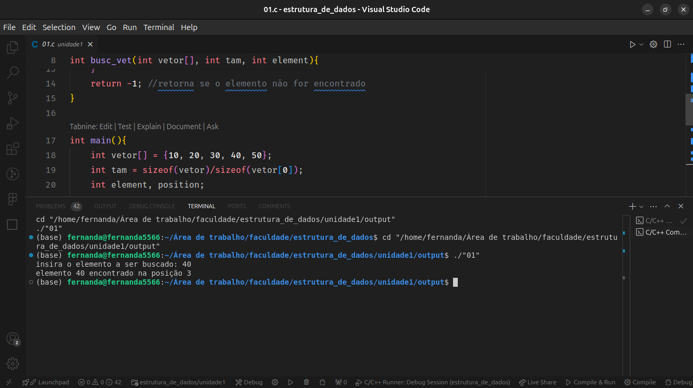
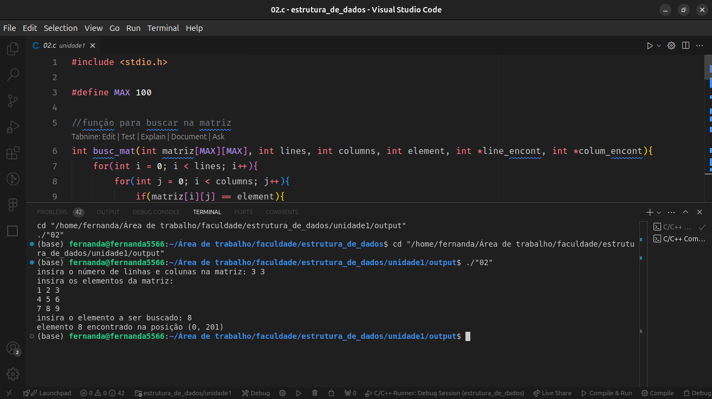
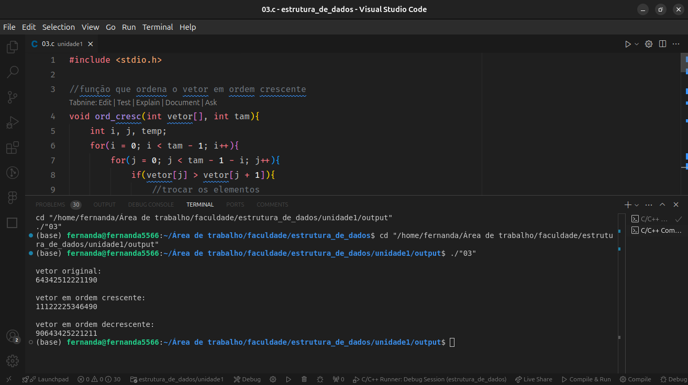
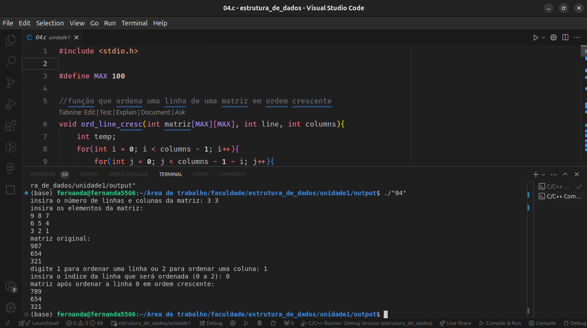

# Atividade Unidade 1 - AVA
Questões da Unidade 1 do EAD AVA - IFCE 

## Crie um programa em C que realiza operações básicas em vetores e matrizes, como busca por um elemento específico, ordenação dos elementos e exibição dos resultados na tela.

# Tarefas:

# Questões:
## 01.c 
Implementar uma função de pesquisa em vetores que recebe como parâmetros o vetor, seu tamanho e o elemento a ser buscado. A função deve retornar a posição do elemento no vetor ou -1 caso o elemento não seja encontrado.

## 02.c
Implementar uma função semelhante para realizar a pesquisa em matrizes, considerando as linhas e colunas.

## 03.c
Implementar funções para ordenar um vetor em ordem crescente e decrescente, utilizando os métodos de ordenação de sua escolha.

## 04.c 
Implementar funções semelhantes para realizar a ordenação das linhas ou colunas de uma matriz.

## 1. Implementação de Métodos de Pesquisa:
- Implementar uma função de pesquisa em vetores que recebe como parâmetros o vetor, seu tamanho e o elemento a ser buscado. A função deve retornar a posição do elemento no vetor ou -1 caso o elemento não seja encontrado.
- Implementar uma função semelhante para realizar a pesquisa em matrizes, considerando as linhas e colunas.

## 2. Implementação de Métodos de Classificação: 
- Implementar funções para ordenar um vetor em ordem crescente e decrescente, utilizando os métodos de ordenação de sua escolha.
- Implementar funções semelhantes para realizar a ordenação das linhas ou colunas de uma matriz.

## 3. Testes de Programa:
- No programa principal, criar vetores e matrizes com valores aleatórios para teste.
- Utilizar as funções implementadas para realizar operações de pesquisa e classificação nos vetores e matrizes.
- Exibir os resultados na tela para verificar se as operações foram realizadas corretamente.
  
  
  
  
## Observações:
- Comente o código e a escolha os métodos de pesquisa e classificação que considere mais eficientes para a situação.
